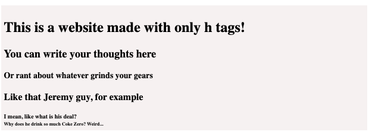
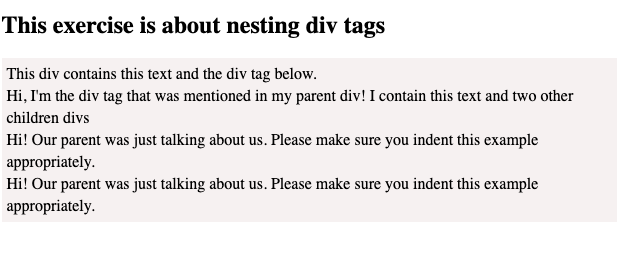
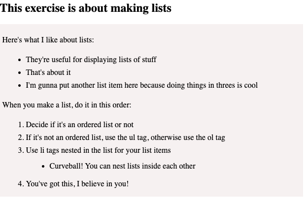
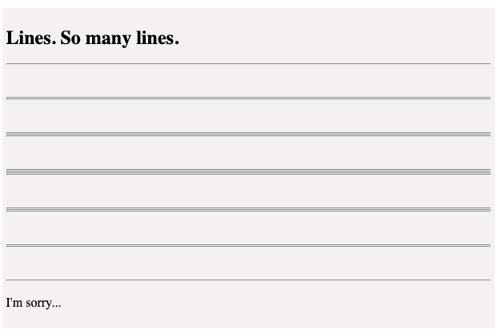
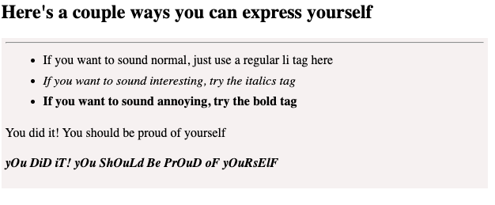
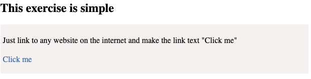

# HTML Homework

To solidify your knowledge, here are a set of exercises that will require you to use the techniques you've just learned in the lesson.

## Objectives

- Understand the basics of HTML
- Write HTML
- Use a handful of most-used HTML elements

## Instructions 

- Navigate to a location on your local computer in VSCode where you keep your homework 
- Clone this repsository by typing the following command in your terminal 

```bash 
git clone git@github.com:DigitalCraftsStudents/html-hw-101-using-tags.git
```

- Navigate into the folder titled `html-hw-101-using-tags`
- Create a new file called `index.html`
- Scaffold out a new html structure inside of `index.html` 
- Complete the problems below.  **Note, all images are inside of the images folder**


1. Headings 
<br>



2. Nesting Tags
<br>



3. Lists
<br>



4. Lines 
<br>



5. Styling Text
<br>



6. Images
<br>


7. Links
<br>



8. Linking Images
<br>


